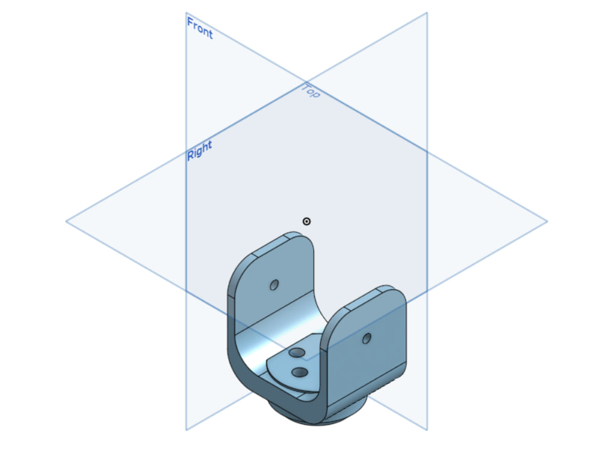

# 🤖 Robotic Arm Joint – 3D CAD Design

This repository contains a detailed 3D model of a robotic arm joint created as part of a mechanical design task. The component is designed using Onshape, with precise dimensions, circular cutouts, and base structure to represent a movable joint used in robotic arms.

The final design is exported in both STL and SolidWorks (.sldprt) formats to ensure compatibility with various tools including 3D printing, FEA simulation, and CAD assembly. This task focuses on creating a clean, functional joint that can be used or tested as part of a full robotic system.

---

## 📸 Preview

---

## 📁 Project Files

| File Name                         | Format       | Description                         |
|----------------------------------|--------------|-------------------------------------|
| design-RoboticArmJoint.stl     | STL          | Mesh format suitable for 3D printing |
| design-RoboticArmJoint.sldprt  | SolidWorks   | Native SolidWorks part file         |
| screenshot-RoboticArmJoint.png | PNG          | Screenshot of the 3D design         |

---

## 🧰 Tools Used

- Onshape CAD – For modeling and precise dimensioning  
- STL Export – For universal sharing and 3D printing  
- SolidWorks Export – For use in simulation or mechanical assemblies

---

## 📦 Output Summary

- 3D modeled robotic joint with holes and base structure
- Exported in two formats: STL & SolidWorks
- Ready for simulation, printing, or assembly
- Includes screenshot showing final design preview
